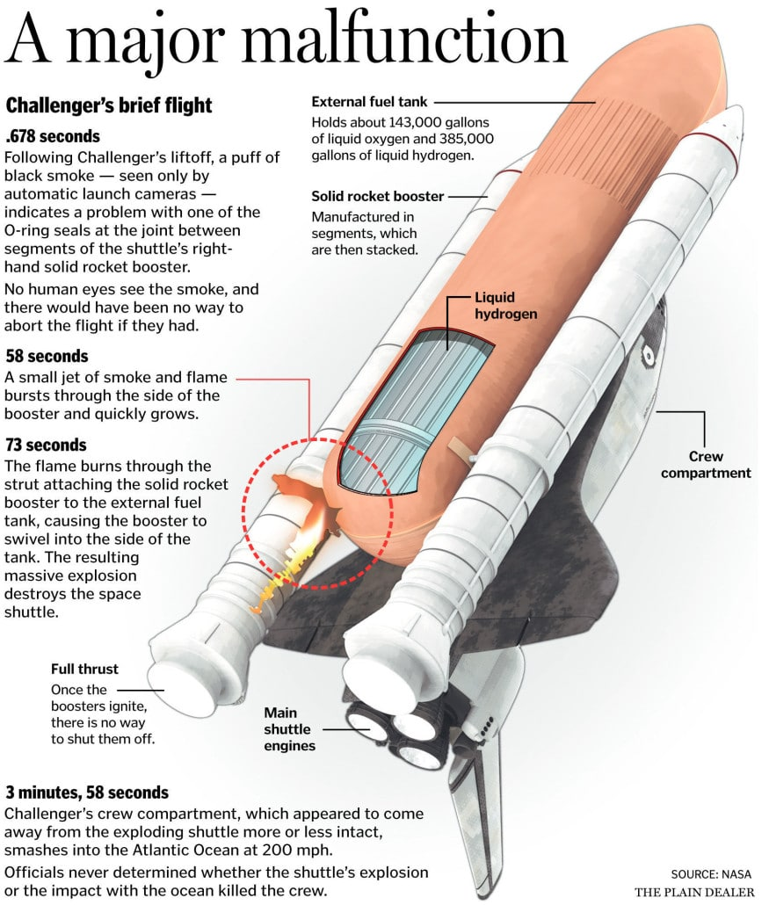

# Week 1: Introduction to UI and UX Design

## Welcome to the Course!
- Explore the **principles** of good design.
- Discover the **difference** between UI and UX.
- Start your journey toward **designing your own app**.

## Good and Bad Designs in History

#

#

### Example 1: **Good Design**
- **The London Tube Map (1931)**  
  - Created by Harry Beck.
  - Simplified complex subway routes into an intuitive design.  
  - Users found it easy to navigate.

### Example 2: **Bad Design**
- **The Titanic Lifeboat Plan (1912)**  
  - Insufficient lifeboats for passengers.
  - Mismanagement of a critical design flaw.
  - A tragic example of ignoring usability in systems.

### Activity: Spot Good and Bad Design
1. Look around you or think about everyday objects or apps.
2. **Task**: 
   - Write down one **great design** and one **bad design** you’ve encountered.
   - Be prepared to share why!

# 1. Course Introduction

## Course Objectives
- Understand **UI (User Interface)** and **UX (User Experience)** design.
- Learn how design improves usability and quality of life.
- Apply design principles to create your own app.

## Final Project: Create Your Own App
- **Goal**: Design a UI/UX for a useful application.
- **Milestones**:
  1. Personas
  2. Wireframes
  3. Prototypes
  4. Final presentation
- Show your progress weekly!

# 2. What is Design?

## Design as Problem-Solving
- **Definition**: The act of solving problems for users in a functional, aesthetic, and intuitive way.
- Goes beyond appearance—it’s about making life **easier and better**.

## Examples of Good Design

https://www.versionmuseum.com/history-of/google-search

1. **The Eames Chair (1956)**  
   - Simple, ergonomic, and durable.

2. **Google Search Interface**  
   - Minimalistic yet powerful.

## Examples of Bad Design

1. **The Segway (2001)**  
   - Overhyped but impractical for most users.

2. **Microsoft's Clippy (1997)**  
   - Distracting and often unhelpful, leading to user frustration.

# 3. UI vs. UX: Definitions and Differences

## What is UI?
- **User Interface (UI)**: Visual elements a user interacts with:
  - Buttons
  - Menus
  - Layouts
  - Typography

## What is UX?
- **User Experience (UX)**: The overall experience of using a product:
  - Ease of use
  - Emotional impact
  - Journey from start to finish

## Activity: UI vs. UX
- Think of an app you’ve recently used.
- **Task**:
  - Identify one UI element you liked or disliked.
  - Identify one UX aspect that worked or didn’t.
- Share your findings with the class.

# 4. Interactive Activities

## Activity 1: Redesign a Common Object
1. **Task**: Sketch an improved design for an everyday object (e.g., water bottle, umbrella).
2. **Goal**: Focus on improving usability and user satisfaction.
3. **Share**: Present your redesign to the group.

## Activity 2: Redesign a Simple Experience
1. **Scenario**: Choose a task to redesign, such as:
   - **Ordering food online**
   - **Booking a train ticket**
2. **Deliverables**:
   - Create a rough UI sketch.
   - Propose UX improvements.

# 5. Wrap-Up and Homework

## Key Takeaways
- Design is about solving problems.
- **UI** focuses on visuals and interactivity.
- **UX** focuses on the overall user journey.

## Homework
1. Identify two examples of **good UI/UX** and **bad UI/UX** in your daily life.
   - Reflect on why they are effective or ineffective.
   - Suggest potential improvements.
2. Submit your reflection to the class forum.
3. Prepare for **Week 2: Cognitive Characteristics in Design**.

# Thank You!
## Questions or Comments?
Prepare for Week 2 by observing how people interact with everyday designs!