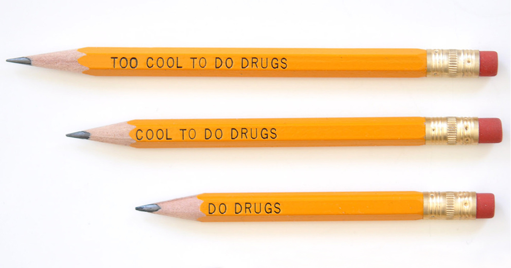

<!-- the far side -->

#

<!-- my kyoto door app -->

#

<!-- pencil too cool to do drugs -->

#

<!-- la parking sign 

#
-->
INNOVATION

#

What do you think Tomoyo?

# 

<table style="width:100%">
  <thead>
    <tr>
      <th>週</th>
      <th>テーマ</th>
      <th>内容</th>
    </tr>
  </thead>
  <tbody>
    <tr>
      <td>1</td>
      <td>UI/UXの基本</td>
      <td>良いデザイン・悪いデザインを探究する</td>
    </tr>
    <tr>
      <td>2</td>
      <td>認知特性の理解</td>
      <td>使いやすいデザインの基礎</td>
    </tr>
    <tr>
      <td>3</td>
      <td>デザインプロセス</td>
      <td>ワイヤーフレームを作成</td>
    </tr>
    <tr>
      <td>4</td>
      <td>UI心理学</td>
      <td>ユーザー行動を考慮した設計</td>
    </tr>
    <tr>
      <td>5</td>
      <td>ナビゲーション</td>
      <td>直感的な操作を設計</td>
    </tr>
    <tr>
      <td>6</td>
      <td>デバイス対応</td>
      <td>モバイル・PCの制約を理解</td>
    </tr>
    <tr>
      <td>7</td>
      <td>プロトタイピング</td>
      <td>Figmaでプロトタイプ作成</td>
    </tr>
    <tr>
      <td>8</td>
      <td>UIプレゼン</td>
      <td>UIデザインの発表とフィードバック</td>
    </tr>
    <tr>
      <td>9</td>
      <td>UXリサーチ</td>
      <td>ユーザー調査と分析</td>
    </tr>
    <tr>
      <td>10</td>
      <td>UXコンセプト</td>
      <td>デザイン案を具体化</td>
    </tr>
    <tr>
      <td>11</td>
      <td>UXプロトタイピング</td>
      <td>フィードバックを反映</td>
    </tr>
    <tr>
      <td>12</td>
      <td>UXプレゼン</td>
      <td>UXデザインの発表とフィードバック</td>
    </tr>
    <tr>
      <td>13</td>
      <td>UI業界の知識</td>
      <td>UIデザイナーの講義</td>
    </tr>
    <tr>
      <td>14</td>
      <td>UX業界の知識</td>
      <td>UX専門家のゲスト講義</td>
    </tr>
  </tbody>
</table>

# 

Grading
<table style="width:80%; border-collapse: collapse; font-size: 20px;">
  <thead style="background-color: #e0e0e0;">
    <tr>
      <th width="25%" style="font-size:1.4em;padding: 16px; border: 1px solid #ccc;">評価項目</th>
      <th width="10%"  style="font-size:1.4em;padding: 16px; border: 1px solid #ccc;">割合</th>
      <th style="font-size:1.4em;padding: 16px; border: 1px solid #ccc;">説明</th>
    </tr>
  </thead>
  <tbody>
    <tr>
      <td style="font-size:1.4em;padding: 16px; border: 1px solid #ccc;">ミニレポート</td>
      <td style="font-size:1.4em;padding: 16px; border: 1px solid #ccc;">50%</td>
      <td style="font-size:1.4em;padding: 16px; border: 1px solid #ccc;">授業内で行うアクティビティ <strong>Padletに投稿</strong></td>
    </tr>
    <tr>
      <td style="font-size:1.4em;padding: 16px; border: 1px solid #ccc;">最終レポート</td>
      <td style="font-size:1.4em;padding: 16px; border: 1px solid #ccc;">50%</td>
      <td style="font-size:1.4em;padding: 16px; border: 1px solid #ccc;">毎週の課題を積み重ねて完成させるプロジェクトの成果物 <strong>Padletに投稿</strong></td>
    </tr>
  </tbody>
</table>

合計50点以上を合格とする。

出席は５回以上休んだらアウト！

#

Let's Padlet

<xl>①</xl>

https://padlet.com/yohda/uiux2025mini

<xl>②</xl>
https://padlet.com/tsasao/uiux2025project

